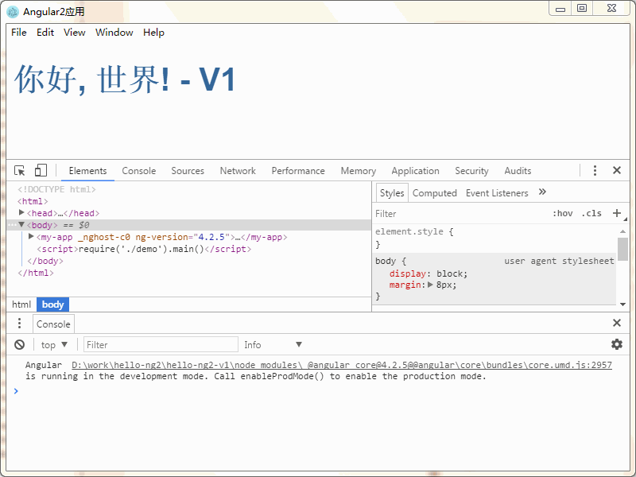

# 极简的Angular2示例, Electron环境运行


Angular2本身提供了cli命令行工具, 可以生成完整的工程.

但是命令行生成的工程太过复杂, 对于新学习Angular的用户会有太多的干扰.

我们尝试完全脱离cli工具, 只是通过TypeScript提供的tsc命令, 纯手工构造一个极简的Angular2示例.

完整代码: http://git.oschina.net/chai2010/hello-ng2

## 配置淘宝的镜像

通过以下命令安装:

	npm install -g cnpm --registry=https://registry.npm.taobao.org

完成后用 `cnpm` 代替 `npm` 命令.

## HTML启动页面

首先构造一个 hello-ng2 目录, 用于存放工程文件.

在目录下创建 demo.html 页面, 内容如下:

```html
<!DOCTYPE html>

<head>
	<title>Angular2应用</title>
</head>

<body>
	<my-app>加载UI组件</my-app>
	<script>require('./demo').main()</script>
</body>
```

我们采用的是HTML5语法, 完全省略了最外层没有任何意义的`<html></html>`标签.

其中包含了一个我们自定义的`<my-app>`标签, 对应我们要创建的 Angular 窗口组件.

然后通过`require`加载当前目录下的`demo`模块(对应demo.js文件), 然后运行其中的`main`函数启动Angular程序.

## Angular组件

Angular严重依赖ES7中的注解语法, 如果要在JS中使用该特性, 将需要一个转码工具将ES7注解语法转为ES2015或更早的格式,
因为只有这样才能在浏览器中正常运行.

虽然JS社区中已经存在了很多类似的转码工具(我本人将这个看作是一个编译过程, 和将C/C++代码转为exe类似), 但是依赖太多.

既然必需要引入一个转码工具, 强烈推荐使用TypeScript语言提供的tsc工具. 因为TypeScript语言本身是Angular官方采用的语言,
同时也提供了注解等特性, 而且其提供的tsc工具没有任何外部依赖(失控的依赖绝对是一个灾难).

创建 demo.ts 文件, 并针对`<my-app>`标签创建一个 Angular 窗口组件:

```typescript
import * as ngCore from '@angular/core'

@ngCore.Component({
	selector: 'my-app',
	template: `
		<h1>你好, {{name}}! - V1</h1>
	`,
	styles: [
		`h1 {
			color: #369;
			font-family: Arial, Helvetica, sans-serif;
			font-size: 250%;
		}`,
	],
})
export class MainComponent {
	name = '世界'
}
```

## Angular模块

为了使用该窗口部件, 我们需要将其组织到一个 Angular 模块中:

```
import * as ngPlatformBrowser from '@angular/platform-browser'

@ngCore.NgModule({
	imports: [ ngPlatformBrowser.BrowserModule ],
	declarations: [ MainComponent ],
	bootstrap: [ MainComponent ],
})
export class MainModule {
	//
}
```

同样, 我们通过 `@ngCore.NgModule` 注解将 Angular 的运行时模块和 MainModule 类进行了关联.

在模块中, 我们导入了 `ngPlatformBrowser.BrowserModule` 浏览器模块.

同时, `declarations` 部分声明了我们自己创建的Angular组件.

最后, `bootstrap` 部分将 MainComponent 指定为该模块的引导组件.

需要说明的是, NgModule 修饰的模块是一种运行时模块, 同时用于其中各种组件名字空间的管理.

## 启动Angular模块

一个应用中可以有多个Angular 模块, 同样要指定一个引导模块, 通过以下代码完成:

```typescript
import * as ngPlatformBrowserDynamic from '@angular/platform-browser-dynamic'

export function main() {
	ngPlatformBrowserDynamic.platformBrowserDynamic().bootstrapModule(MainModule)
}
```

到此, 一个极简的Angular2示例已经完成了. 但是还不能运行!

不能运行的原因主要有2个:

- 浏览器环境不支持模块方式启动页面, 同样需要通过外部js库辅助.
- Angular 依赖一些高级的特性, 很多浏览器环境并不支持, 需要通过外部js库模拟.

为了简化, 我们采用了Electron环境运行应用, 因为在Electron环境我们可以直接使用NodeJS中的模块.
对于第二点, 我们可以通过以下外部js库模拟缺少的特性:

```typescript
import 'core-js/es6/reflect'
import 'core-js/es7/reflect'
import 'zone.js/dist/zone'
```

## Electron环境

现在 Angular2 部分的代码已经完整. 我们还需要给 Electron 创建一个启动脚本.

新建一个 index.ts 文件, 用于启动Angular2程序:

```typescript
import * as fs from 'fs'
import * as electron from 'electron'

let win: Electron.BrowserWindow = null

function createWindow() {
	win = new electron.BrowserWindow({width: 800, height: 600})
	win.loadURL(`file://${__dirname}/demo.html`)
	win.webContents.openDevTools()

	win.on('closed', () => { win = null })
}

function main() {
	electron.app.on('ready', () => {
		createWindow()
	})
	electron.app.on('activate', () => {
		createWindow()
	})
	electron.app.on('window-all-closed', () => {
		if(process.platform !== 'darwin') {
			electron.app.quit()
		}
	})
}

if(require.main === module) {
	main()
}
```

其中 `BrowserWindow` 对应一个 Electron 窗口, 创建窗口后通过 `win.loadURL` 加载了 `demo.html` 页面.

## 其他配置文件

为了运行应用, 我们还需要package.json和tsconfig.json文件, 分别对应NodeJS包和TypeScript的配置信息.

其中 package.json 文件千篇一律, 并没有什么特别之处. tsconfig.json文件则有一些需要定制的特性.

tsconfig.json 内容如下:

```json
{
	"include": [
		"./**/*"
	],
	"exclude": [
		"node_modules",
		"**/*.spec.ts"
	],

	"compilerOptions": {
		"module": "commonjs",
		"moduleResolution": "node",
		"lib": ["dom", "es2016"],
		"emitDecoratorMetadata": true,
		"experimentalDecorators": true,
		"suppressImplicitAnyIndexErrors":true,
		"noStrictGenericChecks": true,
		"noImplicitAny": false,
		"target": "es5"
	}
}
```

其中 `include` 表示用通配符选择文件, `exclude` 表示排除的文件, `compilerOptions` 对应编译选项.

在编译选项中, 我们需要指定依赖的dom和es2016库, experimentalDecorators表示注解功能也必须打开,
emitDecoratorMetadata表示生成元信息也必须打开(元信息是反射特性所需要的).

其它的编译参数用于可以根据需要自行调整.

## 运行

克隆完整代码, 进入到对应目录的命令行, 然后安装依赖并运行:

```
cnpm install
node_modules\.bin\tsc
node_modules\.bin\electron .
```

运行效果图:



OK!

